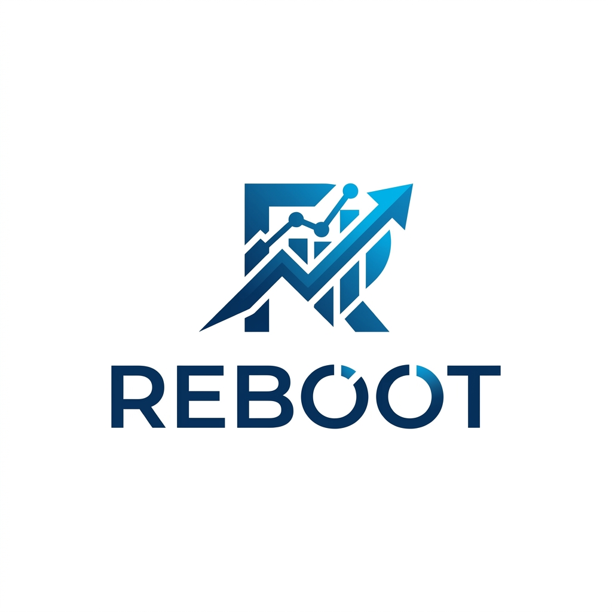

# Reboot Project



## Overview

**Reboot** is a modern, premium-grade web application designed for **real‑time market data visualization** and **trading strategy simulation**. Built with a focus on **rich aesthetics**, the UI features glassmorphism, dynamic animations, and a dark‑mode friendly design that delivers a premium user experience.

## Key Features

- **Live Market Data**: Pulls real‑time market feeds via WebSockets.
- **Interactive Charts**: High‑performance, draggable, zoomable charts powered by Canvas.
- **Strategy Playground**: Define, back‑test, and visualize custom strategies.
- **Responsive Layout**: Optimized for desktop, tablet, and mobile devices using CSS container queries and flexible grid layouts.
- **Dark / Light Themes**: Seamless theme toggling with CSS variables.
- **Extensible Plugin System**: Easily add new data providers or chart types.

## Getting Started

### Prerequisites

- **Node.js** (v20 or later) – provides the runtime for the development server.
- **npm** – package manager (comes with Node).

### Installation

```bash
# Clone the repository (if you haven't already)
git clone https://github.com/arhamchhajed101/Reboot.git
cd Reboot

# Install dependencies
npm install
```

### Running Locally

```bash
npm run dev
```

The application will be available at `http://localhost:3000`. Open this URL in your browser to explore the UI.

## Project Structure

```text
├── app
│   └── main.py                # Core backend service (Python)
├── frontend/                  # All client‑side assets
│   ├── index.html
│   ├── style.css               # Global stylesheet with theme variables
│   ├── app.js                  # Main JavaScript entry point
│   └── assets/
│       ├── logo.svg
│       └── reboot_logo.jpg   # Logo used in the README
├── demo_run.py                 # Example script to launch the full stack
├── test_market_data.py         # Basic unit tests for market‑data utilities
├── RECURZ_Execution_Engine_PRD.docx   # Project documentation (PDF export recommended)
└── RECURZ_Execution_Engine_Tech_Stack.docx
```

## Development Guidelines

- **Styling** – All UI components use **vanilla CSS** with a design‑system defined in `frontend/style.css`. Avoid Tailwind unless explicitly needed.
- **JavaScript** – Use modern ES2023 syntax. Modules are imported via native `import` statements.
- **Version Control** – Follow the conventional‑commits style for commit messages.
- **Testing** – Run `npm test` for client‑side tests and `python -m unittest discover` for backend tests.

## Contributing

Contributions are welcome! Please follow these steps:

1. Fork the repository.
2. Create a feature branch (`git checkout -b feature/your-feature`).
3. Commit your changes with clear messages.
4. Open a pull request describing the changes.

> **Tip:** Ensure your code adheres to the existing design system and passes all linting rules (`npm run lint`).

## License

This project is licensed under the **MIT License** – see the `LICENSE` file for details.

---

*Prepared by the Antigravity AI assistant on 2026‑08‑22.*
